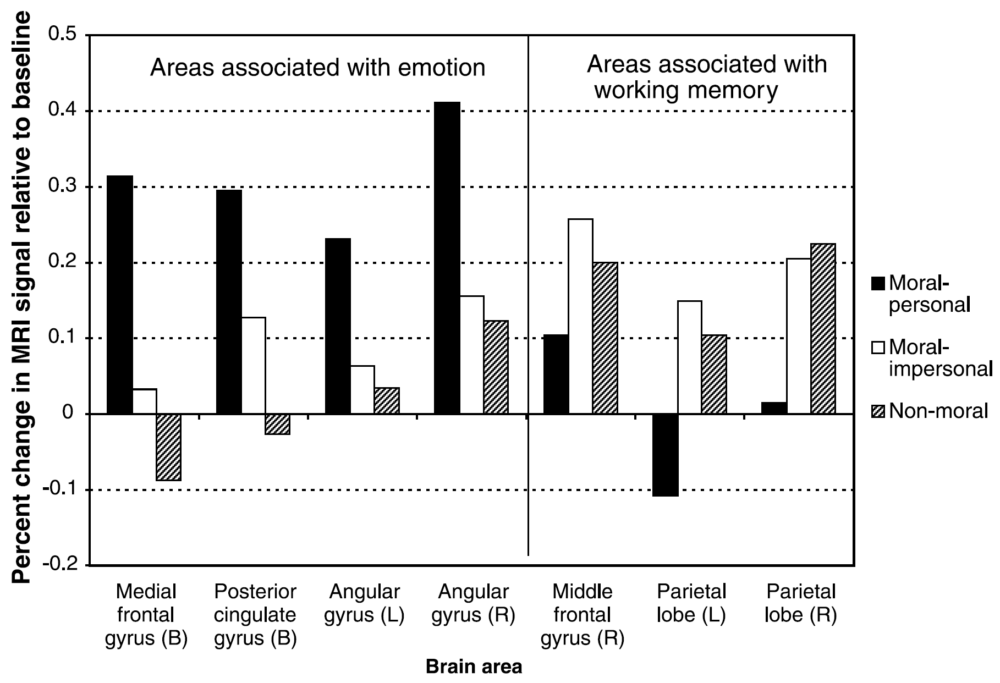
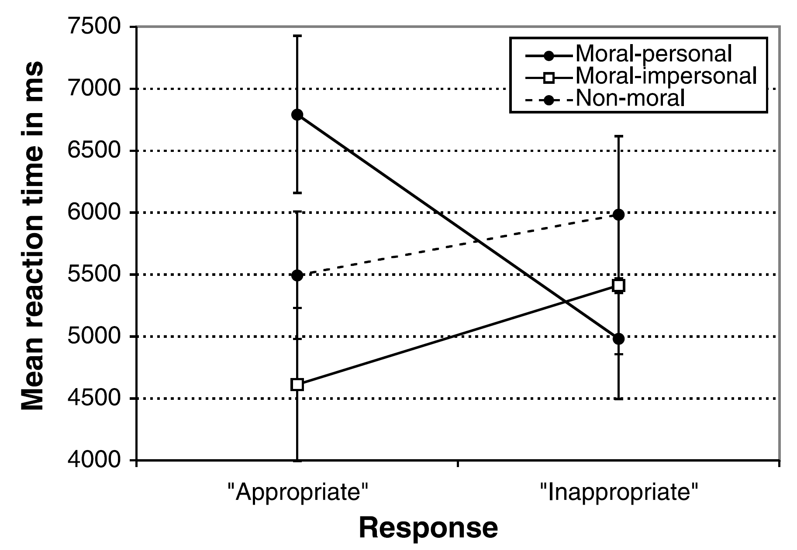

# Einleitung

Immer wieder finden wir uns in Situationen wieder, in denen wir uns entscheiden müssen, was wir tun sollen, welche Handlung in dieser Situation moralisch angebracht ist und welche nicht. Oft müssen wir nicht lange überlegen, intuitiv ist uns klar, welche Handlung die richtige ist. Doch hin und wieder befinden wir uns in einer Situation, in der die Antwort nicht so klar scheint. Aber auch in solchen Fällen gelangen wir schliesslich meist zu einem Urteil. Das zentrale Thema der vorliegenden Arbeit ist, _wie_ wir zu unseren moralischen Urteilen gelangen und wie zuverlässig unsere moralischen Urteile sind. In Kapitel 2.1 soll geklärt werden, ob unsere moralischen Urteile kulturell erlernt sind, oder ob sie uns angeboren sind. Die Kapitel 2.2 und 2.3 beschäftigen sich mit der Frage, ob beim moralischen Urteilen eher rationale Überlegungen zum Zuge kommen, oder ob wir moralische Urteile doch eher intuitiv fällen, wie einige Studien nahe legen. Kapitel 2.4 ist der Frage gewidmet, ob unsere moralischen Urteile zuverlässig und rational sind und Kapitel 2.5 behandelt schliesslich die Frage, welche Faktoren Einfluss nehmen auf die Bildung unserer moralischen Urteile. Im ganzen Kapitel 2 werden hauptsächlich Ergebnisse aus neurowissenschaftlichen Studien präsentiert, welche sich damit beschäftigen, wie wir moralische Urteile fällen. In Kapitel 3 geht es dann darum, welche Auswirkungen die Ergebnisse dieser Studien auf die Moraltheorien aus der Philosophie haben. Im Allgemeinen reagieren die Philosoph\*innen auf zwei Arten auf diese Befunde aus den Neurowissenschaften: wie in Kapitel 3.1 gezeigt wird, sind einige Philosoph\*innen der Ansicht, dass neurowissenschaftliche Resultate für Moraltheorien bedeutungslos sind, da die beiden Themengebiete völlig getrennt voneinander sind. Andere Philosoph\*innen hingegen räumen diesen Ergebnissen einige Bedeutung zu, wie in Kapitel 3.2 gezeigt werden soll. 

Bevor aber mit der Diskussion der Studien begonnen werden kann, müssen einige Begrifflichkeiten geklärt werden. Hauptthema dieser Arbeit ist - wie bereits erwähnt - die Kausalität moralischer Urteile. Unter _moralischem Urteil_ verstehe ich - und ich stütze mich dabei auf Haidt [-@haidtEmotionalDogIts2001, 817] - eine Bewertung (richtig oder falsch) einer Handlung oder des Charakters einer Person. In Kapitel 2 werden dazu die Begriffe moralische Überlegung und moralische Intuition wichtig werden, weshalb ich auch zu diesen beiden Begriffen an dieser Stelle eine Definition abgeben möchte. Unter _moralischer Überlegung_ soll in dieser Arbeit eine bewusste (d.h. willentliche und kontrollierbare) mentale Aktivität verstanden werden, die darin besteht, gegebene Informationen über Menschen umzuwandeln, um zu einem moralischen Urteil zu gelangen [vgl. @haidtEmotionalDogIts2001, 818]. _Moralische Intuitionen_ werden als das plötzliche Auftauchen eines moralischen Urteils im Bewusstsein, einschliesslich einer affektiven Valenz (gut-schlecht) definiert, ohne dass man sich bewusst ist, Schritte der Suche nach oder des Abwägens von Beweisen oder des Ableitens einer Schlussfolgerung durchlaufen zu haben [vgl. @haidtEmotionalDogIts2001, 818].

# Kausale Faktoren beim moralischen Urteilen

In diesem Kapitel sollen unterschiedliche Faktoren untersucht werden, die Einfluss auf unser moralisches Urteil haben. Diese Faktoren beinhalten zum einen Faktoren, von denen wir natürlicherweise davon ausgehen, dass sie für unser moralisches Urteil von Bedeutung sind, wie beispielsweise Verursachung und Absichtlichkeit, aber auch einige Faktoren, von denen wir normalerweise nicht davon ausgehen, dass sie unser Urteil beeinflussen und von denen wir uns auch wünschen, dass sie unser Urteil nicht beeinflussen. So haben zum Beispiel einige neuere Studien gezeigt, dass auch Faktoren wie die Sauberkeit unserer Umgebung unser moralisches Urteil beeinflussen können. Begonnen wird aber mit der Frage, ob unsere moralischen Urteile zu einem gewissen Grad angeboren sind, oder ob sie ausschliesslich der Kultur entspringen. Danach wird die Frage thematisiert, ob unsere moralischen Urteile unserem Verstand oder unseren Intuitionen entspringen. 

## Biologische und kulturelle Ursprünge  moralischen Urteilens

Eine grosse Frage, die sich in Bezug auf unsere Fähigkeit, moralische Urteile zu fällen, stellt, ist die Frage nach dem Ursprung dieser Fähigkeit. Sind moralische Urteile in angeborenen Eigenschaften verwurzelt oder lassen sie sich vollständig durch erworbene kulturelle Eigenschaften erklären? Im 20. Jahrhundert fielen die Antworten der Wissenschaftler\*innen auf diese Frage eher extrem aus. Während der Psychologe B. F. Skinner [-@skinnerFreedomDignity1971]  moralische Regeln als sozial bedingte Verhaltensmuster sah und der Meinung war, dass man Menschen dazu bringen könne, so ziemlich alles als moralisch richtig oder falsch zu beurteilen, wenn man nur die richtigen Verstärkungen nutzte, war der Biologe E. O. Wilson [-@wilsonSociobiologyNewSynthesis2000] der Ansicht, dass fast die gesamte menschliche Moral durch die Anwendung der Evolutionsbiologie verstanden werden könne. Zu Beginn des 21. Jahrhunderts begannen jedoch die meisten Wissenschaftler\*innen auf dem Gebiet des moralischen Urteilens ein hybrides Modell zu bevorzugen, welches sowohl biologischen als auch kulturellen Faktoren eine Rolle zuweist [vgl. @riniMoralityCognitiveScience2015].

Ein Beispiel für einen solchen modernen Ansatz ist die *Moral Foundations theory* vom Psychologen Jonathan Haidt [-@haidtRighteousMindWhy2012]. Haidt hebt die Rolle kultureller Unterschiede bei der wissenschaftlichen Untersuchung von Moralität hervor. Ihm zufolge lassen sich alle dokumentierten moralischen Überzeugungen in eine Handvoll moralischer Unterbereiche einordnen, wie beispielsweise Schadensvermeidung, Gerechtigkeit (bei der Verteilung von Gütern), Respekt vor Autorität und Reinheit. Haidt argumentiert, dass moralische Unterschiede zwischen den Kulturen Unterschiede in der Gewichtung dieser Grundlagen widerspiegeln. Eine Kultur, die alle moralischen Intuitionen, die der menschliche Geist zu erfahren bereit ist, gleich gewichtet, würde Handlungsunfähigkeit riskieren, da jede Handlung mehrere widersprüchliche Intuitionen auslöst. Wenn ein Kind geboren wird, ist es bereit, in allen Bereichen moralische Intuitionen zu entwickeln, aber sein lokales kulturelles Umfeld betont im Allgemeinen nur ein oder zwei dieser Ethiken. Intuitionen innerhalb einer kulturell gewichteten Ethik werden stärker ausgebildet, während Intuitionen innerhalb einer nicht gewichteten Ethik schwächer ausgeprägt sind [vgl. @haidtEmotionalDogIts2001,827]. 
Solche *Maintenance-Loss-Modelle* sind auch in anderen Bereichen der menschlichen höheren Kognition dokumentiert worden. Es scheint ein Konstruktionsmerkmal von Säugetiergehirnen zu sein, dass ein Grossteil der neuronalen Entwicklung 'erfahrungserwartend' ist [vgl. @haidtEmotionalDogIts2001, 827]. Das heisst, es gibt entwicklungszeitlich festgelegte Perioden hoher neuraler Plastizität, als ob das Gehirn zu einem bestimmten Zeitpunkt bestimmte Arten von Erfahrung 'erwartet', um seine endgültige Verdrahtung zu steuern. Solche sensiblen Perioden sind in der Entwicklung der sensorischen Systeme [vgl. @hubelPeriodSusceptibilityPhysiological1970] und der Sprache [vgl. @johnsonCriticalPeriodEffects1989] gut dokumentiert.
Haidt besteht aber auch darauf, dass die Biologie eine wichtige Rolle bei der Erklärung moralischer Urteile spielt: Er sieht jeden dieser moralischen Unterbereiche in einem bestimmten evolutionären Ursprung verwurzelt. Bereits 2001 schrieb er:

> It [das sozial intuitionistische Modell, welches Haidt vertritt] proposes that morality, like language, is a major evolutionary adaptation for an intensely social species, built into multiple regions of the brain and body, that is better described as emergent than as learned yet that requires input and shaping from a particular culture. Moral intuitions are therefore both innate and enculturated [@haidtEmotionalDogIts2001,826].

Haidts Theorie ist nach wie vor ziemlich umstritten, aber sie ist ein prominentes Beispiel dafür, dass zeitgenössische Wissenschaftler\*innen sich darauf konzentrieren, polarisierte Antworten auf die Frage 'Biologie oder Kultur' zu vermeiden [vgl. @riniMoralityCognitiveScience2015].

## Wie wir moralische Urteile fällen: durch rationale Überlegungen oder Intuitionen?

Eine entscheidende Frage ist, ob moralische Urteile aus bewussten Überlegungen und Reflexion entstehen oder durch unbewusste und unmittelbare Impulse ausgelöst werden. In den 1970er und 1980er Jahren wurde die Forschung in der Moralpsychologie durch die Arbeiten von Lawrence Kohlberg dominiert, der eine stark rationalistische Konzeption des moralischen Urteilens vertrat  [vgl. @riniMoralityCognitiveScience2015]. Seit der Wende zum zwanzigsten Jahrhundert hat man sich aber von dieser Ansicht gelöst. Ein Wendepunkt war die Veröffentlichung von Jonathan Haidts Arbeit _The Emotional Dog and Its Rational Tail_ [-@haidtEmotionalDogIts2001]. Dort erörtert Haidt ein Phänomen, das er als _moral dumbfounding_ bezeichnet. Er stellte seinen Probanden provokative Geschichten vor, wie beispielsweise die folgende Geschichte von einem Bruder und einer Schwester, die bewusst Inzest betreiben:

> Julie and Mark are brother and sister. They are traveling together in France on summer vacation from college. One night they are staying alone in a cabin near the beach. They decide that it would be interesting and fun if they tried making love. At the very least it would be a new experience for each of them. Julie was already taking birth control pills, but Mark uses a condom too, just to be safe. They both enjoy making love, but they decide not to do it again. They keep that night as a special secret, which makes them feel even closer to each other. What do you think about that? Was it OK for them to make love? [@haidtEmotionalDogIts2001,814] 

Die meisten Probanden urteilten, dass Bruder und Schwester in diesem Szenario moralisch falsch gehandelt haben, als sie aber gebeten wurden, ihre moralischen Urteile zu dieser Geschichte zu erklären, nannten sie Gründe, die durch die Beschreibung der Geschichten ausgeschlossen zu sein scheinen - so sagten sie zum Beispiel, dass die inzestuösen Geschwister ein Kind mit gefährlichen Geburtsfehlern erzeugen könnten, obwohl die Geschichte deutlich macht, dass sie sehr vorsichtig waren und sogar doppelt verhüteten, um eine Empfängnis zu vermeiden. Als sie an diese Details erinnert wurden, revidierten die Probanden ihre moralischen Urteile nicht, sondern sie sagten Dinge wie: *'Ich weiss nicht, warum es falsch ist, es ist einfach so'*. Haidt sieht solche Aussagen als Beweis dafür, dass das rationalistische Modell moralischen Urteilens nicht zutreffen kann: wie sollte es erklären, dass jemand weiss, dass eine Handlung moralisch falsch ist, aber nicht, warum, wenn moralische Urteile auf rationalen Überlegungen basieren? Haidt schlägt daher ein alternatives Modell vor: das sozial intuitionistische Modell [vgl. @haidtEmotionalDogIts2001, 814]. Dieses Modell besagt, dass wir moralische Urteile nicht durch rationale Überlegungen fällen, sondern die rationalen Überlegungen lediglich unser bereits gefälltes moralisches Urteil rationalisieren sollen. Das Modell ist insofern ein soziales Modell, als es die private Argumentation der Individuen in den Hintergrund rückt und stattdessen die Bedeutung sozialer und kultureller Einflüsse betont. Das Modell ist insofern ein intuitionistisches Modell, als es festhält, dass das moralische Urteil im Allgemeinen das Ergebnis von schnellen, automatischen Bewertungen (Intuitionen) ist [vgl. @haidtEmotionalDogIts2001,814]. Obwohl beim sozial intuitionistischen Modell der Fokus klar auf moralischen Intuitionen liegt, räumt Haidt rationalen, moralischen Überlegungen doch auch einen Platz ein. Folgende drei Funktionen würden rationale Überlegungen erfüllen [vgl. @haidtEmotionalDogIts2001,828-829]:

- Die erste Funktion ist, dass die (ex post facto) moralische Überlegung von Menschen eine kausale Wirkung haben kann - auf die Intuitionen anderer Menschen. Aus der Sicht der sozialen Intuitionisten ist das moralische Urteilsvermögen nicht nur eine einzelne Handlung, die im Verstand einer einzelnen Person stattfindet, sondern ein fortlaufender Prozess, der sich oft über einen längeren Zeitraum und über mehrere Personen erstreckt. Begründungen und Argumente können zirkulieren und Menschen beeinflussen, auch wenn sich Einzelne nur selten mit privaten moralischen Überlegungen beschäftigen.
- Die zweite Funktion ermöglicht es, dass Menschen manchmal private moralische Überlegungen für sich selbst anstellen können, insbesondere wenn ihre anfänglichen Intuitionen in Konflikt geraten. Abtreibung mag sich für viele Menschen falsch anfühlen, wenn sie an den Fötus denken, aber richtig, wenn sie ihre Aufmerksamkeit auf die Frau verlagern. Wenn konkurrierende Intuitionen gleich stark sind, gerät das Beurteilungssystem in eine Sackgasse. Unter solchen Umständen verwendet man Argumentation und Intuition zusammen, um die Blockade zu durchbrechen. Das heisst, wenn man ein Dilemma bewusst untersucht und sich dabei abwechselnd auf jede beteiligte Partei konzentriert, werden verschiedene Intuitionen ausgelöst, die zu verschiedenen widersprüchlichen Urteilen führen. Mit Hilfe der Vernunft kann dann für jedes Urteil eine Argumentation konstruiert werden. Wenn die Argumentation für eines der Urteile besser ist als für die anderen, wird sich dieses Urteil richtig anfühlen.
- Die dritte Funktion besteht darin, dass eine Person im Prinzip einfach durch reine rationale Überlegungen zu einem Urteil gelangen könnte, das ihrer ursprünglichen Intuition widerspricht. Haidt zufolge geschieht dies aber höchst selten. Die Tatsache, dass es dennoch vorkommt, reicht aber bereits aus, um zu zeigen, dass das reine moralische Schlussfolgern eine kausale Rolle beim Fällen moralischer Urteile spielen kann.

Andere Wissenschaftler\*innen kritisieren aber, dass Haidt rationalen Überlegungen nicht genügend Platz einräumt. Paxton&Greene [-@paxtonMoralReasoningHints2010] beispielsweise schlagen ein alternatives Modell vor, welches sie _dual-process model_ nennen und welches rationalen moralischen Überlegungen mindestens gleich viel Raum gibt wie moralischen Intuitionen. Beispielsweise postulieren sie, dass eine Person das Urteil einer anderen Person beeinflussen kann, und zwar nicht, indem sie die Intuition dieser Person modifiziert, sondern indem sie an die Vernunftfähigkeit dieser Person appelliert, Urteile zu formulieren, die mit ihren anderen moralischen Verpflichtungen vereinbar sind.

## Die Neuroanatomie moralischer Urteile

Eine weitere interessante Frage ist, welche Gehirnareale beim Fällen moralischer Urteile aktiv sind. Eine äusserst einflussreiche Studie zum moralischen Urteilen wurde von Joshua D. Greene und Kollegen durchgeführt. In dieser Arbeit wurde die funktionelle Magnetresonanztomografie (fMRI) eingesetzt, bei der ein starker Magnet verwendet wird, um eine visuelle Darstellung der relativen Niveaus der in verschiedenen Hirnarealen verwendeten zellulären Energie zu erzeugen. Der Einsatz der fMRI ermöglicht es den Forschern und Forscherinnen, eine nahezu Echtzeit-Darstellung der Gehirnaktivitäten zu erhalten, während das bewusste Subjekt Urteile über moralisch relevante Szenarien fällt. Die Studie von Greene et al. zeigt, dass wir bei moralischen Urteilen oft intuitiv entscheiden (stützt als Haidt's Theorie). Diese Studie befasste sich mit einem Thema, das Philosophen und Philosophinnen schon länger beschäftigt: mit den Trolley-Dilemmata, genauer mit dem Standard Trolley-Problem und der Footbridge-Variante davon. Beim Standard Trolley-Problem steht jemand an einem Gleis und bemerkt, dass ein führerloser Trolley das Gleis hinunterrollt und auf eine Gruppe von fünf Personen zufährt. Diese Personen werden alle getötet, wenn der Trolley auf seinem Weg weiterfährt. Die Person hat nun aber die Möglichkeit, eine Weiche umzustellen, die den Trolley auf ein Nebengleis umleitet, auf dem sich aber auch eine Person befindet, welche getötet wird, wenn die Weiche umgestellt wird. Auf die Frage, was diese Person tun soll, antworten die meisten Menschen, dass sie den Trolley auf das Nebengleis umleiten soll und so diese fünf Menschen auf dem Hauptgleis auf Kosten der einen Person auf dem Nebengleis retten soll. Bei der Footbridge-Variante des Trolley-Problems geht es ebenfalls um einen Trolley, der droht, fünf Menschen auf dem Gleis zu töten, diesmal steht die Person aber nicht neben einer Weiche, sondern auf einer Fussgängerbrücke, die über dem Gleis verläuft. Die Person hat keine Möglichkeit, den Trolley irgendwie umzuleiten. Sie erwägt kurz, von der Brücke vor den Trolley zu springen und sich zu opfern, um so die anderen fünf Personen zu retten, kommt aber schnell zum Schluss, dass sie selbst viel zu leicht ist, um den Trolley aufzuhalten: Sie würde nur mit den anderen Personen sterben. Neben ihr steht aber ein grosser und dicker Fremder. Die einzige Möglichkeit, den Trolley aufzuhalten und damit die fünf Menschen zu retten, ist es, den Fremden von der Brücke vor den Trolley zu stossen, was den Fremden töten würde. Auf die Frage, was die Person in dieser Situation tun sollte, sagen die meisten Menschen, dass sie den Fremden *nicht* von der Brücke stossen sollte.

Die von Greene und seinen Kollegen durchgeführte Studie soll nun die Frage beantworten, was es im Trolley-Dilemma moralisch akzeptabel macht, ein Leben zu opfern, um fünf zu retten, aber nicht im Footbridge-Dilemma [vgl. @greeneFMRIInvestigationEmotional2001, 2105-2106]. Um dieser Frage nachzugehen, haben sie zwei fMRI-Studien durchgeführt. Die Autoren vermuteten, dass der entscheidende Unterschied zwischen dem Trolley-Dilemma und dem Footbridge-Dilemma darin besteht, dass letzteres die Emotionen der Menschen auf eine Art und Weise involviert, wie es das erstere nicht tut. Der Gedanke, jemanden in den Tod zu stossen, ist emotional stärker geprägt als der Gedanke, einen Schalter zu betätigen und es ist diese emotionale Reaktion, die die Neigung der Menschen erklärt, diese Fälle unterschiedlich zu behandeln. Greene et al. stellen die allgemeinere Hypothese auf, dass einige moralische Dilemmata (solche, die dem Footbridge-Dilemma in relevantem Masse ähnlich sind) in grösserem Masse emotionale Verarbeitung erfordern als andere (solche, die dem Trolley-Dilemma in relevantem Masse ähnlich sind), und dass diese Unterschiede in der emotionalen Involviertheit sich auf die Urteile der Menschen auswirken. Die Autoren machen zwei Vorhersagen, die sie in ihrer Studie testen [vgl. @greeneFMRIInvestigationEmotional2001, 2106]:

1. Mit Emotionen verbundene Hirnareale (medialer frontaler Gyrus, hinterer zingulärer Gyrus und bilateraler STS) sind aktiver bei der Auseinandersetzung mit Dilemmata wie dem Footbridge-Dilemma im Vergleich zur Auseinandersetzung mit Dilemmata wie dem Trolley-Dilemma.
2. Es gibt ein Muster von _Verhaltensinterferenzen_ (ähnlich wie in kognitiven Aufgaben, in denen automatisierte Prozesse Reaktionen beeinflussen können, z.B. der Stroop task). Die Autoren behaupten, dass die Testpersonen eine starke, automatische emotionale Reaktion im Footbridge-Dilemma haben, die ihnen sagt, dass es nicht in Ordnung ist, einen Menschen von der Brücke zu stossen, um fünf andere zu retten. Die Autoren erwarten, dass diejenigen Testpersonen, die dennoch sagen, dass es in Ordnung ist, den dicken Mann von der Brücke zu stossen - entgegen ihrer emotionalen Reaktion – aufgrund dieser emotionalen Interferenz eine längere Reaktionszeit haben. Generell sagen sie längere Reaktionszeiten für Tests voraus, bei denen die Antwort des Probanden nicht mit der emotionalen Reaktion übereinstimmt (z.B. 'angemessen' für ein Dilemma wie das Footbridge-Dilemma). Sie haben das Fehlen solcher Effekte für Dilemmata wie dem Trolley-Dilemma vorhergesagt, die nach ihrer Theorie mit geringerer Wahrscheinlichkeit eine starke emotionale Reaktion hervorrufen.

In den Experimenten wurden beide Vorhersagen bestätigt. Es wurden drei Arten von Dilemmata getestet [vgl. @greeneFMRIInvestigationEmotional2001, 2106]:

- **Nicht-moralisch**: z.B. Fisch mit Reis oder Kartoffeln servieren?
- **Moralisch-persönlich**: z.B. Footbridge-Dilemma; unerlaubtes Entnehmen von Organen, um sie an fünf andere Menschen zu verteilen; Leute von einem sinkenden Rettungsboot stossen
- **Moralisch-unpersönlich**: z.B. Trolley-Dilemma; das Geld behalten, das man in einer verlorenen Geldbörse gefunden hat

Die Testpersonen mussten jeweils angeben, ob sie eine Handlung für angebracht oder unangebracht halten. Die Resultate der Experimente werden in den Abbildungen 1 und 2 dargestellt.

Wie man erkennen kann, sind bei den moralisch-persönlichen Dilemmata diejenigen Gehirnareale, die mit Emotionen in Verbindung gebracht werden, signifikant aktiver als bei moralisch-unpersönlichen und nicht-moralischen Dilemmata. Zudem sind Bereiche, die mit dem Arbeitsgedächtnis assoziiert werden, während der emotionalen Verarbeitung weniger aktiv als während kognitiver Verarbeitung. In Experiment 2 zeigt sich, dass diejenigen Testpersonen, die in moralisch-persönlichen Dilemmata (wie dem Footbridge-Dilemma) urteilten, dass es ‘angebracht’ ist, den Fremden von der Brücke zu stossen, eine längere Reaktionszeit hatten als diejenigen, die in dieser Situation ‘unangebracht’ urteilten. Dies wird von den Autoren darauf zurückgeführt, dass sie ‘entgegen ihrer Intuitionen’ entscheiden, d.h. dass auch diese Personen ganz automatisch die Intuition haben, dass es unangebracht ist, den Fremden vor den Trolley zu stossen und diese Intuition dann aber mit rationaler Überlegung ‘überwinden’, was Zeit kostet [vgl. @greeneFMRIInvestigationEmotional2001, 2106-2107]. Sehr oft wird argumentiert, dass im Trolley-Dilemma die meisten Personen ein utilitaristisches Urteil fällen, während die Mehrheit der Probanden im Footbridge-Dilemma ein deontologisches Urteil fällt. Entsprechend werden die Resultate dieser Studie dann so gedeutet, dass utilitaristische Urteile durch rationale Überlegungen gefällt werden, während deontologische Urteile ihren Ursprung in der Aktivität von Gehirnarealen haben, die mit Emotionen assoziiert werden [vgl. @tennantHowWeMake2015]. Einige Philosophen [vgl. z.B. @singerEthicsIntuitions2005] argumentieren auf dieser Basis, dass moralische Intuitionen nicht verlässlich sind und es daher nicht zulässig ist, eine Theorie (z.B. den Präferenzutilitarismus, wie ihn Singer vertritt) aufgrund kontraintuitiver Aussagen zu verwerfen. Hierbei stimmt ihm auch Greene selbst zu, der in diesen psychologischen Fakten einen Grund sieht, unseren deontologischen Urteilen zu misstrauen [vgl. @greenePointandShootMoralityWhy2014]. 

## Die Zuverlässigkeit moralischer Urteile

Eine weitere wichtige Frage in Bezug auf moralische Urteile ist die Frage, ob unsere moralischen Urteile zuverlässig sind. Während es in den vorangegangenen Abschnitten darum ging, welche _Prozesse_ für die Bildung moralischer Urteile verantwortlich sind, geht es nun um die _Qualität_ dieser Urteile. Es ist dabei wichtig zu beachten, dass auch unbewusste Prozesse (in diesem Fall intuitives Urteilen) zuverlässige Urteile liefern können. Viele einfache mathematische Berechnungen machen wir unbewusst, deshalb sind sie aber nicht irrational oder unzuverlässig.

Verschiedene Studien zeigen, dass unsere moralischen Urteile in manchen Fällen unzuverlässig und daher vermutlich auch teilweise irrational sind. Ein berühmtes Beispiel für eine solche Studie ist die folgende Studie von den Psychologen Amos Tversky und Daniel Kahneman aus den frühen 1980er Jahren. Hier ist der Text, den sie ihren Probanden vorlegten:

> Imagine that the U.S. is preparing for the outbreak of an unusual Asian disease, which is expected to kill 600 people. Two alternative programs to combat this disease have been proposed. Assume that the exact scientific estimate of the consequences of the programs are as follows:

> If Program A is adopted, 200 people will be saved.

> If Program B is adopted, there is a 1/3 probability that 600 will be saved, and 2/3 probability that no people will be saved [@tverskyFramingDecisionsPsychology1981, 453].

Andere Teilnehmer lasen eine modifizierte Form dieses Szenarios, in der die erste Option darin besteht, dass 400 Menschen sterben werden und die zweite Option darin, dass es eine 1/3 Wahrscheinlichkeit gibt, dass niemand stirbt, und eine 2/3 Wahrscheinlichkeit, dass 600 Menschen sterben. Die beschriebenen Szenarien sind somit eigentlich identisch, nur die Wortwahl ist anders. In beiden Programmen A würden gleich viele Menschen sterben bzw. gerettet werden und in beiden Programmen B sind die Wahrscheinlichkeiten für die jeweiligen Ergebnisse mathematisch äquivalent. Dennoch fallen die Entscheidungen der Probanden sehr unterschiedlich aus, je nachdem, wie ihre Wahlmöglichkeiten beschrieben wurden: diejenigen, die die ursprüngliche Formulierung lasen, bevorzugten Programm A drei zu eins, während diejenigen, die die andere Formulierung lasen, fast genau die entgegengesetzte Präferenz zeigten [vgl. @tverskyFramingDecisionsPsychology1981, 453]. Je nachdem also, ob die Situation in Bezug auf das Sterben der Menschen oder das Retten der Menschen formuliert wird, entscheiden sich die Probanden für Programm B bzw. A. Diese Studie ist eine der bekanntesten in der Literatur über _framing effects_, die zeigt, dass die Urteile der Menschen durch rein verbale Unterschiede in der Art und Weise, wie eine Reihe von Optionen präsentiert wird, beeinflusst wird. 

Unsere moralischen Urteile werden aber nicht nur durch solche _framing effects_ beeinflusst, sondern - wie aus verschiedenen Studien hervorgeht - auch durch völlig zufällige Merkmale der Umgebung, in der wir Urteile fällen. Um ein sehr einfaches Beispiel zu nennen: Wenn Sie sich hinsetzen, um Ihre Urteile über moralisch fragwürdige Handlungen aufzuschreiben, hängt die Schwere Ihrer Reaktion zum Teil von der Sauberkeit des Tisches ab, an dem Sie sitzen [vgl. @schnallDisgustEmbodiedMoral2008]. Wenn der Tisch um Sie herum klebrig und mit Pizzaschachteln bedeckt ist, werden Sie das schlechte Verhalten wahrscheinlich härter beurteilen als wenn er schön sauber ist. Ebenso werden Sie wahrscheinlich negativere moralische Urteile abgeben, wenn Sie bittere Flüssigkeiten getrunken haben [vgl. @eskineBadTasteMouth2011]. Wenn Sie sich einen lustigen Film ansehen, werden Sie Gewalt vorübergehend weniger streng verurteilen [vgl. @strohmingerDivergentEffectsDifferent2011].

Solche Studien zeigen, dass unsere moralischen Urteile durch unterschiedliche Faktoren beeinflusst werden, insbesondere auch durch solche, die wir als moralisch irrelevant betrachten. Dies hat zur Folge, dass einige unserer moralischen Urteile unzuverlässig und womöglich auch irrational sind. 

## Einflussfaktoren bei der Bildung moralischer Urteile

Cushman&Young [-@cushmanPatternsMoralJudgment2011] untersuchen in drei Experimenten zwei wichtige Unterscheidungen, die moralische Akteure bei der Beurteilung einer Handlung zu beachten scheinen: Handlung gegen Unterlassung und Mittel gegen Nebenwirkung.

Eine Studie von Spranca et al. [-@sprancaOmissionCommissionJudgment1991], in der Probanden eine Vielzahl von Fällen von aktiver und passiver Schadenszufügung nebeneinander verglichen, zeigt, dass diejenigen Probanden, die in ihrem moralischen Urteil eine Unterscheidung zwischen Handlung und Unterlassung zeigten (d.h. den Akteur als moralisch schlechter beurteilten als den Unterlassenden), wiesen in ihrem kausalen Urteil ebenfalls eine signifikant höhere Wahrscheinlichkeit auf, eine Unterscheidung zwischen Handlung und Unterlassung zu treffen (d.h. sie beurteilten, dass die Handlung mehr Schaden verursachte als die Unterlassung). Diese Ergebnisse legen nahe, dass die Unterscheidung zwischen Handlung und Unterlassung auf nicht-moralische Eigenschaften der kausalen Zuschreibung zurückzuführen ist. Das heisst, die Teilnehmer nehmen einen moralischen Unterschied zwischen Handlungen und Unterlassungen wahr, weil sie Handlungen als eher kausal wahrnehmen als Unterlassungen [vgl. @cushmanPatternsMoralJudgment2011, 1056]. Jüngere Studien legen jedoch eine alternative Darstellung dieser Ergebnisse nahe. Diese Studien [vgl. z.B. @alickeCulpableControlPsychology2000; @knobeConceptIntentionalAction2006; @cushmanPatternsMoralJudgment2011] zeigen nämlich, dass die Kausalattributionen der Menschen tatsächlich durch den moralischen Status der fraglichen Handlung beeinflusst werden: Je schlechter das Verhalten einer Person ist, desto mehr schreiben ihr die Beobachter eine kausale Verantwortung zu. Folglich kann die Tendenz, schädliche Handlungen als eher kausal als schädliche Unterlassungen einzustufen, eine Folge (und nicht eine Ursache) der moralischen Unterscheidung zwischen Handlung und Unterlassung sein.

Cushman&Young [-@cushmanPatternsMoralJudgment2011] zeigen in ihrer Studie auch, dass die Unterscheidung in Mittel und Nebenwirkung, d.h. die Unterscheidung, ob eine moralisch schlechte Handlung als Mittel zu einem anderen Ziel ausgeführt wird oder ob eine Handlung einen vorhersehbaren moralisch schlechten Nebeneffekt hat, hauptsächlich davon beeinflusst wird, ob die moralisch schlechte Handlung _absichtlich_ ausgeführt wird. Während es also bei der Unterscheidung Handlung/Unterlassung hauptsächlich um Kausalattribution geht, geht es bei der Unterscheidung Mittel/Nebeneffekt um Absichtsattribution. Die meisten Philosophen sind davon ausgegangen, dass etwas, das eine Person getan hat, nur dann als moralisch richtig oder falsch bewertet werden kann, wenn die Person vorsätzlich gehandelt hat (zumindest in gewöhnlichen Fällen, wobei Fahrlässigkeit ausser Acht gelassen werden muss). Wenn Peter Anna absichtlich stolpern lässt, dann ist diese Handlung moralisch falsch, wenn Peter hingegen Anna versehentlich stolpern lässt, dann ist das lediglich bedauerlich. Es scheint also, die Beurteilung von Absicht müsse kausal vor der Beurteilung der Moralität einer Handlung stattfinden.  Das heisst, wenn ich eine potenziell moralisch relevante Situation beurteile, stelle ich zunächst fest, ob die betroffene Person absichtlich gehandelt hat, und dann nutze ich dieses Urteil als Input, um herauszufinden, ob das, was sie getan hat, moralisch falsch ist. 
Empirische Belege legen jedoch nahe, dass dieses einfache Modell falsch ist.  Eine bekannte Reihe von Studien über den Nebenwirkungseffekt (auch bekannt als  _Knobe-Effekt_, nach seinem Entdecker Joshua Knobe) scheint zu zeigen, dass die kausale Beziehung zwischen moralischem Urteil und Absichtsurteil viel komplizierter ist. Joshua Knobe liess seine Probanden eine Kurzgeschichte wie die folgende lesen: 

> The vice-president of a company went to the chairman of the board and said, “We are thinking of starting a new program. It will help us increase profits, but it will also harm the environment.” The chairman of the board answered, “I don’t care at all about harming the environment. I just want to make as much profit as I can. Let’s start the new program.” They started the new program. Sure enough, the environment was harmed [@knobeIntentionalActionSide2003,191].

Andere Teilnehmer lasen die gleiche Geschichte, nur dass das Programm als Nebeneffekt der Umwelt eher _helfen_ als schaden würde. Beide Teilnehmergruppen wurden gefragt, ob die Führungskraft den Nebeneffekt absichtlich herbeigeführt habe. Auffallend war, dass 82 % der Probanden dachten, dass der Nebeneffekt absichtlich herbeigeführt wurde, wenn die Nebenwirkung moralisch falsch war (die Umwelt zu schädigen), aber wenn die Nebenwirkung moralisch richtig war (der Umwelt zu helfen), dachten 77 % der Probanden, dass der Nebeneffekt _nicht_ absichtlich herbeigeführt wurde [vgl. @knobeIntentionalActionSide2003,192]. Dieses Experiment (die Befunde wurden in vielen anderen Studien repliziert) legt nahe, dass die kausale Beziehung zwischen der Bewertung der Absichtlichkeit und dem moralischen Urteil nicht unidirektional ist. Menschen fällen manchmal moralische Urteile, bevor sie die Absichtlichkeit beurteilen. Anstatt, dass die Beurteilung der Absichtlichkeit immer ein Input für die moralische Beurteilung ist, ist die moralische Beurteilung manchmal ein Input für die Beurteilung der Absichtlichkeit. Eine Nebenwirkung, die als falsch beurteilt wird, wird mit grösserer Wahrscheinlichkeit als absichtlich beurteilt als eine, die als moralisch richtig beurteilt wird.

# Neurowissenschaft und Philosophie

Die Neurowissenschaften liefern uns also Informationen darüber, wie unsere moralischen Urteile kausal zustande kommen. Aber die Philosoph\*innen sind sich nicht einig darüber, was man von diesen Informationen halten soll. Einige sind der Meinung, dass diese Ergebnisse der Neurowissenschaften für philosophische Theorien völlig irrelevant sind. Andere hingegen sehen für solche neurowissenschaftlichen Ergebnisse durchaus einen Platz in der Philosophie. In diesem Kapitel sollen unterschiedliche Argumente für beide Seiten behandelt werden.

## Neurowissenschaftliche Ergebnisse sind für Moraltheorien nicht von Belang

Ein gewichtiger Einwand gegen die Einbeziehung neurowissenschaftlicher Ergebnisse basiert auf der Unterscheidung zwischen Sein-Aussagen und Sollens-Aussagen. Wir können grundsätzlich zwei Arten von Aussagen unterscheiden: deskriptive Sätze, die beschreiben, wie etwas *ist* (z.B. *'Die Katze sass auf dem Balkon'*) und präskriptive Sätze, die sagen, wie etwas sein *soll* oder *nicht sein soll* (z.B. *'Es war falsch, die Katze vom Balkon zu stossen'*). Es ist sehr wichtig, diese beiden Arten von Aussagen klar zu trennen, denn wenn man dies nicht tut, so läuft man Gefahr, einen Sein-Sollens-Fehlschluss zu begehen. Dabei schliesst man von einer deskriptiven Aussage auf eine präskriptive Aussage, was jedoch nicht ohne weiteres zulässig ist [vgl. @humeTreatiseHumanNature2009]. Nur weil etwas ist, wie es ist, heisst das nicht, dass es auch so sein soll.

Kognitionswissenschaftliche Erkenntnisse sind Aussagen des Sein-Typs; sie beschreiben Fakten darüber, wie unser Verstand tatsächlich arbeitet, und nicht darüber, wie er arbeiten sollte. Uns interessieren hier aber eine besondere Art von deskriptiven Aussagen: nämlich deskriptive Aussagen über den Ursprung präskriptiver Urteile, d.h. Sein-Aussagen über den Ursprung von Sollens-Aussagen. Einige Philosophen und Philosophinnen argumentieren nun, dass Versuche, moralische Überzeugungen auf der Grundlage kognitionswissenschaftlicher Erkenntnisse zu ändern, auf Verwirrungen und Verwechslungen von Sein- und Sollens-Aussagen basieren und daher nicht zulässig sind. Sie behaupten, es sei eine Art Kategorienfehler, unsere Überzeugungen in einem präskriptiven Bereich entscheidend von Aussagen in einem deskriptiven Bereich abhängig zu machen oder sie gar deshalb zu revidieren [vgl. @riniMoralityCognitiveScience2015].
Natürlich ist damit nicht gemeint, dass es immer falsch ist, moralische Überzeugungen auf der Grundlage neuer wissenschaftlicher Informationen anzupassen. Stellen Sie sich vor, Sie sind Chef einer Sprengmannschaft und stehen kurz davor, den Auslöser zu drücken, um eine alte Fabrik in die Luft zu sprengen. Plötzlich schreit eines Ihrer Besatzungsmitglieder: _"Warten Sie, schauen Sie auf den Wärmemonitor! Da ist eine Wärmesignatur im Inneren der Fabrik - das ist wahrscheinlich eine Person! Sie sollten den Auslöser nicht drücken!"_ Es wäre äusserst unpassend, wenn Sie antworten würden, dass die Entscheidung, ob Sie den Auslöser drücken sollen oder nicht, nicht von den Erkenntnissen wissenschaftlicher Vorrichtungen wie Wärmemonitoren abhängen kann  [vgl. @riniMoralityCognitiveScience2015]. Es kann also nicht darum gehen, _alle_ empirischen Informationen von moralischen Überlegungen auszuschliessen. Aber es ist wichtig zu beachten, dass das wissenschaftliche Instrument selbst uns nicht sagt, was wir tun sollen. Wir können nicht einfach moralische Schlussfolgerungen aus deskriptiven wissenschaftlichen Fakten ablesen. Wir brauchen eine Art Brückenprämisse; etwas, das die rein deskriptive Aussage mit einer präskriptiven Aussage verbindet. Im Fall der Sprengmannschaften könnte eine solche Brückenprämisse etwa eine solche Form haben: _'Wenn das Drücken eines Auslösers den gewaltsamen Tod einer unschuldigen Person verursacht, dann sollte man den Auslöser nicht drücken.'_ Bei alltäglichen moralischen Interaktionen bleiben die Brückenprämissen oft implizit - es ist für jede beteiligte Person in diesem Szenario offensichtlich, dass die Anwesenheit eines unschuldigen Menschen die Falschheit der geplanten Sprengung impliziert [vgl. @riniMoralityCognitiveScience2015].
Aber es besteht ein Risiko, wenn wir unsere Brückenprämissen implizit belassen. Manchmal scheint man sich auf implizite Brückenprämissen zu verlassen, über die man sich nicht einig ist oder die vielleicht gar keinen Sinn ergeben. Hie ein Beispiel dazu: _'Die Fliesen in meiner Küche sind violett, also ist es in Ordnung, wenn Sie diese Babys ertrinken lassen.'_ Es ist tatsächlich schwer, diese Äusserung als etwas anderes als einen Witz oder eine Metapher zu interpretieren. Wenn jemand ernsthaft versuchen würde, darauf zu drängen, würden wir sicherlich verlangen, über die Brückenprämisse zwischen Fliesenfarbe und nautischem Kindermord informiert zu werden, und wir wären skeptisch, dass irgendetwas Plausibles geliefert werden könnte [vgl. @riniMoralityCognitiveScience2015].

Kehren wir nun zu unserer eigentlichen Frage zurück: Ist es legitim, unsere moralischen Urteile aufgrund deskriptiver Aussagen zu verändern? Oder anders gesagt: sollten neurowissenschaftliche Erkenntnisse über den Ursprung unserer moralischen Urteile unsere moralischen Urteile kausal beeinflussen? Nehmen wir folgende Aussage: _'Gehirnareal B ist immer dann besonders aktiv, wenn man es als moralisch falsch erachtet, bei den Steuern zu betrügen. Es ist also moralisch falsch, bei seinen Steuern zu betrügen.'_ Was sollen wir von dieser Behauptung halten? Die scheinbar implizite Brückenprämisse lautet: _'Wenn Hirnareal B aktiv ist, wenn man X als falsch beurteilt, dann ist es falsch, X zu tun'._ Das scheint aber eine etwas spezielle Brückenprämisse zu sein; sie bezieht sich nicht auf interne Merkmale des Steuerbetrugs, die seine Falschheit erklären könnten. Tatsächlich scheint die Prämisse darauf hinzudeuten, dass eine Handlung falsch sein kann, nur weil jemand denkt, sie sei falsch, und im Körper dieser Person eine gewisse neuronale Aktivität stattfindet. Das ist aber nicht, was wir normalerweise tun, um zu moralischen Schlussfolgerungen zu gelangen und es ist unklar, weshalb wir das überzeugend finden sollten [vgl. @riniMoralityCognitiveScience2015].
Laut Berker [-@berkerNormativeInsignificanceNeuroscience2009] mangelt es Joshua Greenes neurowissenschaftlicher Entlarvung der Deontologie (siehe oben) an einer überzeugenden Brückenprämisse. Berker meint, Greene vermeide es, diese Prämisse explizit zu formulieren, denn, wenn sie explizit gemacht würde, wäre sie entweder ein traditionelles moralisches Argument, das die Kognitionswissenschaft nicht zur Begründung seiner Schlussfolgerung heranzieht, oder sie würde kognitionswissenschaftliche Behauptungen verwenden, was aber zu keiner plausiblen moralischen Schlussfolgerung führen würde. Daher, so Berker, sei die Neurowissenschaft normativ unbedeutsam; sie spiele keine Rolle bei einer plausiblen Brückenprämisse zu einer moralischen Schlussfolgerung.
Natürlich impliziert das nur, dass Greenes Argument versagt. Aber Berker und andere Philosophen und Philosophinnen haben Zweifel daran geäussert, dass irgendein kognitionswissenschaftlich fundiertes Argument eine moralische Schlussfolgerung erzeugen könnte. Denn, wenn es eine erfolgreiche Brückenprämisse gäbe, wäre es eine sehr ungewöhnliche. Warum könnte die Tatsache, dass dieser oder jener kausale Prozess einem moralischen Urteil vorausgeht oder es begleitet, uns Anlass geben, unsere Meinung über dieses moralische Urteil zu ändern? Synchrone kausale Prozesse scheinen moralisch nicht relevant zu sein. Was Ihr Gehirn tut, während Sie moralische Urteile fällen, scheint doch eher in die gleiche Kategorie zu fallen wie die Farbe Ihrer Küchenfliesen - warum sollte das von Bedeutung sein?

##  Die Ergebnisse der Neurowissenschaften sollten bei Moraltheorien berücksichtigt werden

Viele Moralphilosophen und Moralphilosophinnen betrachten moralische Urteile (oder Intuitionen) als Beweisstücke bei der Konstruktion von Moraltheorien. Rivalisierende moralische Prinzipien, wie z.B. diejenigen, die Deontologie und Konsequentialismus charakterisieren, werden daraufhin geprüft, ob sie in bestimmten wichtigen Szenarien (z.B. den Trolley-Dilemmata) Handlungsanweisungen geben, die unseren Intuitionen entsprechen. Ist dies nicht der Fall, wird das als Argument gegen diese Theorie verstanden. 
Diese Art der Argumentation steht im Mittelpunkt der normativen Ethik, wie sie von den meisten Philosophen und Philosophinnen praktiziert wird. Moralische Prinzipien werden vorgeschlagen, um intuitive Reaktionen auf bestimmte Szenarien zu erklären. Die besten Prinzipien sind diejenigen, die mit der grössten Anzahl relevanter Intuitionen übereinstimmen. Ein\*e Philosoph\*in, der\*die ein Prinzip infrage stellen möchte, wird ein kluges Gegenbeispiel konstruieren: ein Szenario, in dem es offensichtlich scheint, dass es falsch ist, X zu tun, aber das angestrebte Prinzip erlaubt es uns, X in diesem Fall zu tun. Die Befürworter des Prinzips haben nun vier Möglichkeiten [vgl. @riniMoralityCognitiveScience2015]:

1. zeigen, dass ihr Prinzip falsch angewendet wurde und tatsächlich ein anderes Urteil über das Szenario fällt; 
2. akzeptieren, dass das Prinzip falsche Anweisungen liefert, es aber so verändern, dass es eine bessere Antwort liefert; 
3. in den sauren Apfel beissen und darauf bestehen, dass, selbst wenn das Prinzip hier falsch zu liegen scheint, es immer noch vertrauenswürdig ist, weil es in so vielen anderen Fällen richtig ist; oder 
4. die problematische Intuition wegerklären, indem sie zeigen, dass der Testfall unterschätzt wird oder irgendwie unfair ist oder dass die intuitive Reaktion selbst wahrscheinlich aus einer Verwirrung resultiert. 

Diese Praxis des Testens unterschiedlicher Moraltheorien stützt sich auf die vom Philosophen John Rawls [-@rawlsOutlineDecisionProcedure1951; -@rawlsTheoryJustice1999] vorgeschlagene Theorie des _reflective equilibrim_ (RE). Obwohl der Begriff _reflective equilibrium_ bei Rawls erstmals auftaucht, findet sich die Idee eines Gleichgewichts zwischen Regeln und Schlussfolgerungen und die Notwendigkeit, gegenseitige Anpassungen vorzunehmen, bereits in Goodman [-@goodmanFactFictionForecast1983]. Heutzutage ist das RE in vielen Zweigen der Philosophie eine beliebte Rechtfertigungsmethode, aber es erweist sich als schwierig, eine detaillierte Darstellung davon zu finden [vgl. @beisbartMakingItPreciseInBegutachtung, 2]. Rawls selbst bleibt in seiner Beschreibung des RE leider immer etwas vage und so verstehen verschiedene Autoren verschiedene Methoden darunter. In den vergangenen Jahren wurde die Idee des RE immer weiter ausgearbeitet und präziser formuliert [vgl. z.B. @tersmanRecentWorkReflective2018; @beisbartMakingItPreciseInBegutachtung; @danielsWideReflectiveEquilibrium1996; @brunReflectiveEquilibriumIntuitions2014]. Die allgemeine Idee scheint zu sein, von wohlüberlegten Urteilen (_considered judgments_) zu einem Thema auszugehen und diese dann mit einer Reihe von Prinzipien zu begründen. Sobald man eine Reihe von Prinzipien gefunden hat, die den wohlüberlegten Urteilen ziemlich gut entsprechen, überdenkt man die Urteile und Prinzipien und passt sie einander an, damit sie noch besser zueinander passen. Indem man zwischen den Urteilen und Prinzipien hin- und hergeht und sie gegenseitig aufeinander abstimmt, erreicht man ein Gleichgewicht, in dem Urteile und Prinzipien kohärent sind und sich gegenseitig stützen. Dieses Gleichgewicht nennt man _Überlegungsgleichgewicht_ oder _reflective equilibrium_. Alle unsere Überzeugungen, die an diesem _reflective equilibrium_ beteiligt sind, sind dann gerechtfertigt. Bei Moraltheorien werden Intuitionen über Testszenarien als Beweise für moralische Wahrheit betrachtet, ähnlich wie wissenschaftliche Beobachtungen Beweise für empirische Wahrheit sind. In den Naturwissenschaften hängt unser Vertrauen in eine bestimmte Theorie davon ab, ob sie durch wiederholte Beobachtungen beweiskräftige Unterstützung erhält, und in der Moralphilosophie hängt unser Vertrauen in eine bestimmte ethische Theorie davon ab, ob sie durch mehrere Intuitionen beweiskräftige Bestätigung erhält[^1].

Diese Parallele zwischen Naturwissenschaft und Moralphilosophie zeigt uns eine Möglichkeit auf, wie die Psychologie des moralischen Urteilens für die Moralphilosophie relevant sein könnte. Wenn wir eine wissenschaftliche Theorie testen, hängt unser Vertrauen in jede experimentelle Beobachtung von unserem Vertrauen in die wissenschaftlichen Instrumente ab, die sie ermöglicht haben. Wenn wir an der Zuverlässigkeit unserer Instrumente zweifeln, dann sollten wir an den Beobachtungen zweifeln, die wir von ihnen erhalten, und ebenso sollten wir an den Theorien zweifeln, die sie zu stützen scheinen. Was also, wenn wir an der Verlässlichkeit unserer Instrumente in der Moralphilosophie zweifeln? Unsere Instrumente sind nichts anderes als unser eigener Verstand - oder genauer gesagt, unsere geistigen Fähigkeiten, Situationen zu verstehen und moralische Konzepte auf sie anzuwenden [vgl. @riniMoralityCognitiveScience2015].
Die Kognitionswissenschaft kann uns zwar nicht sagen, welche Handlungen moralisch richtig und welche falsch sind, sie kann uns aber zeigen, dass bestimmte Intuitionen von bestimmten kausalen Faktoren beeinflusst werden. Es liegt dann aber wieder an uns zu entscheiden, welche dieser kausalen Faktoren als verzerrend gelten und welche für das moralische Urteilen akzeptabel sind. Wir sind der moralische Richter, welcher entscheidet, dass beispielsweise die genaue Wortwahl beim Schildern eines Szenarios oder die Sauberkeit des Tisches, an dem wir sitzen, nicht Einfluss auf unser moralisches Urteil haben sollten. Viele Befürworter einer Rolle der Kognitionswissenschaft in der Moraltheorie argumentieren, dass zwar jede Revision unserer moralischen Urteile nur durch einige andere moralische Urteile autorisiert werden kann (und nicht durch die Neurowissenschaft selbst), es aber einige mögliche Revisionen gibt, die wir vornehmen sollten, und die wir nur dank der Erkenntnisse aus den Neurowissenschaften vornehmen können. Es würden wohl alle zustimmen, dass unsere moralischen Urteile nicht durch die Sauberkeit unserer Umwelt beeinflusst werden sollten, dass sie aber tatsächlich durch solche Faktoren beeinflusst werden, wissen wir erst dank solcher Studien. Es scheint also, dass die Qualität unserer moralischen Urteile durch den Einsatz der Kognitionswissenschaften verbessert werden kann [vgl. @riniMoralityCognitiveScience2015].

# Konklusion

Es sollte mittlerweile klar geworden sein, dass die Frage nach der Kausalität moralischer Urteile sehr aktuell und sowohl in den Kognitionswissenschaften also auch in der Philosophie viel diskutiert ist. Die ganzen neurophysiologischen Zusammenhänge scheinen relativ komplex zu sein und vieles ist noch ungewiss. Wissenschaftler wie Jonathan Haidt, Joshua Greene oder Liane Young führen Studie um Studie durch, um etwas mehr Licht ins Dunkel zu bringen. Obwohl man sich in vielen Bereichen noch nicht einig ist (z.B. bei der Frage, wie viel Gewicht moralischen Überlegungen zukommen sollte), hat man doch in einigen Bereichen auch einen Konses gefunden (z.B. ist unsere Moralität sowohl durch biologische als auch durch kulturelle Faktoren stark geprägt). Uneinigkeiten bestehen sowohl unter den Neurowissenschaftlern (welches Modell ist das richtige?), als auch unter den Philosophen (sind die Resultate der Neurowissenschaften relevant für die Moralphilosophie?). 
Ein weiterer Punkt, der in dieser Arbeit nur sehr kurz angesprochen wurde, der aber in einer anderen Arbeit in mehr Details ausgearbeitet werden sollte, ist die Gleichsetzung von deontologischen Urteilen mit der Aktivität von Gehirnarealen, die mit Emotionen assoziiert werden, und die Gleichsetzung von konsequentialistischen Urteilen und der Aktivität von Gehirnarealen, die mit rationalen Überlegungen assoziiert werden. Oft wird argumentiert, deontologische Urteile seien besonders unzuverlässig, da sie auf blossen Intuitionen beruhten und unsere Intuitionen keine sichere Grundlage bieteten. Konsequentialistische Urteile hingegen seien zuverlässiger, da sie rational sind und der Vernunft entspringen. Es wurde noch zu wenig auf die Frage eingegangen, ob wir nicht vielleicht oft auch deontologische Urteile fällen, wenn wir nach einem ursprünglichen Konflikt zwischen mehreren Intuitionen gezwungen sind, Überlegungen anzustellen, um zu einem Urteil zu gelangen. 

[^1]: Einige Philosoph\*innen stehen dieser Analogie zwischen Naturwissenschafte und Ethik kritisch gegenüber, so beispielsweise Peter Singer [-@singerEthicsIntuitions2005]. Einer seiner Kritikpunkte ist es, dass das RE zu konservativ sei. Er verlangt, dass eine Methode in der Ethik es erlaubt, dass wir jede unserer bisherigen Intuitionen aufgeben:

    > A normative moral theory is an attempt to answer the question ‘‘What ought we to do?’’ It is perfectly possible to answer this question by saying: ‘‘Ignore all our ordinary moral judgments, and do what will produce the best consequences.’’ Of course, one would need to give some kind of argument for this answer. My concern now is not to give this argument, or any other argument for possible alternatives to whatever theory best explains our intuitive judgments. My point is that the model of reflective equilibrium, at least as presented in_ A Theory of Justice_, appears to rule out such an answer, because it assumes that our moral intuitions are some kind of data from which we can learn what we ought to do [@singerEthicsIntuitions2005, 346].

    Es gibt für Singer keinen Grund anzunehmen, dass unsere Intuitionen uns in die richtige Richtung lenken und es ist daher auch nicht nötig, dass eine normative Theorie erklären kann, warum unsere Intuitionen im Trolley-Problem und im Footbridge-Problem unterschiedlich sind: im einen Fall sind unsere Intuitionen einfach falsch. Singer postuliert, gestützt auf die Studien von Greene et al., dass es keinen moralisch relevanten Unterschied zwischen diesen beiden Fällen gibt und wir daher konsequenterweise auch in beiden Fällen dasselbe Urteil fällen sollten [vgl. @singerEthicsIntuitions2005, 347].

# Bibliografie